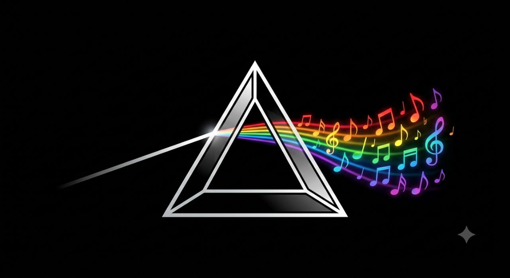

<div class="prism-hero" markdown>

{ .prism-hero-logo }

# Make music that stays reproducible

**Write music as Python. Render it reproducibly.**

Prism puts your tempo, notes, sounds, effects, arrangement, and exports in one
readable `main.py` file. Change the song, run it again, and listen—without
building an application or learning a software framework.

[Create your first song](getting-started/first-song.md){ .md-button .md-button--primary }
[Follow the tutorials](tutorial/README.md){ .md-button }

</div>

## Start with two commands

Open a terminal in the downloaded Prism repository and run:

```text
uv sync --locked
uv run prism create --tutorial
```

Prism creates a timestamped project and prints the exact command that renders
it. Copy that command, then listen to `renders/song.wav`. The
[installation guide](getting-started/installation.md) explains how to install
uv if you do not have it yet.

## Hear Prism

This short loop is rendered by Prism whenever this documentation is built. It
uses generated drums and the native Uniwave synthesizer, so it needs no sample
downloads or audio hardware.

<audio controls preload="metadata" style="width: 100%">
  <source src="assets/audio/uniwave-demo.wav" type="audio/wav">
  Your browser does not support WAV playback.
</audio>

## Everything needed to understand the song is visible

```python
from prism import Project, Uniwave

song = Project("First Prism Song", prism_version="0.2.0.dev0", tempo=120)

kick = song.track("Kick", gain_db=-3).drum(
    "kick",
    "x--- x--- x--- x---",
)

bass = song.track("Bass", gain_db=-6).midi(
    "C2 - C2 Eb2 | G1 - Bb1 -",
    instrument=Uniwave.bass(),
    bars=2,
)

song.section("Loop", bars=4, tracks=[kick, bass])
song.render("renders/song.wav")
```

Samples stay beside the song and generated files go into `renders/`. A project
is just a normal folder, so it remains easy to understand, copy, and back up.

<div class="grid cards" markdown>

-   **Compose**

    ---

    Write notes, chords, drums, samples, reusable clips, variations, fills,
    and complete song sections.

-   **Design sounds**

    ---

    Build layered sounds with the native Uniwave synthesizer, extensible stock
    plugins, or explicitly registered VST3 instruments and effects.

-   **Produce**

    ---

    Shape the mix with ordered effects, automation, buses, sends, master
    processing, swing, and humanization.

-   **Export**

    ---

    Render WAV masters, aligned stems, and standard MIDI files with
    deterministic results.

</div>

## Choose where to go next

- [Make your first song](getting-started/first-song.md) for the shortest path
  from installation to something you can hear.
- [Follow the tutorial learning path](tutorial/README.md) to progress from a
  four-beat loop to an arranged and mixed song.
- [Read the feature guides](guides/concepts.md) when you want to understand a
  particular part of the toolbox.
- [Use the Python reference](reference/index.md) when you need an exact setting
  or method signature.
- [Use external VST3 plugins](guides/external-vst3.md) for Serum, Surge XT,
  Xfer OTT, and other registered instruments or effects.
- [Develop a stock plugin](plugins/adding-stock-plugins.md) when you want to add
  a new native instrument or effect.
